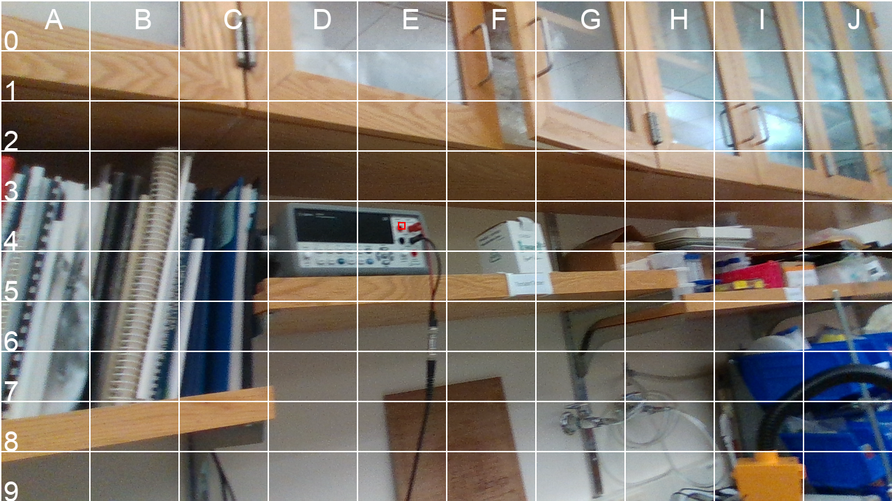

# LlmVisionControl

This is an experiment to see if you can do arbitrary object detection with VLMs (GPT-4).

This repo takes in data from a realsense camera with raw image data and depth data and then outputs a coordinate reference frame of the object you are attempting to detect or an all zero reference frame if the object is not found.

Here is an example of detecting a power supply, something that likely does not exist in any common supervised training data set, but GPT-4 handles just fine

